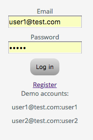
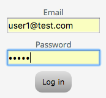
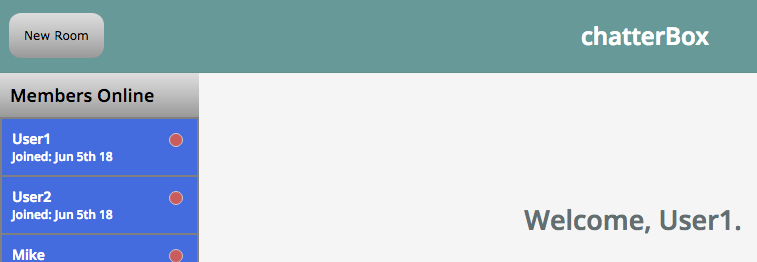
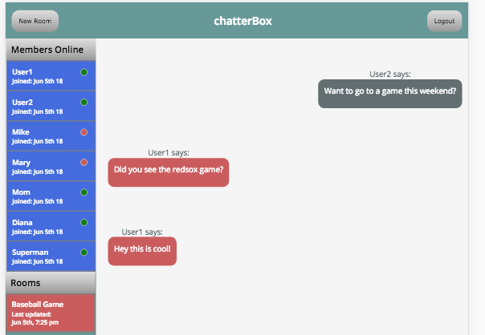

# chatterBox 

## Summary
chatterBox is a chat application that can be used to set up discussion rooms on any subject.

## URL
The app can be access here: https://chatterboxapp.netlify.com/

## Technologies
chatterBox was developed using Node, React and Socket.io. It uses Sass for styling. I wanted to exeriment with real-time applications and learn some new styling options.

## API
The API was built using node.js. 

## Usage
Simply register then begin chatting.

### Register

### Login

### Create a Room on any topic

### Chat away
