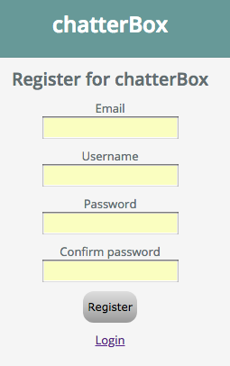

# chatterBox 

## Summary
chatterBox is a chat application that can be used to set up discussion rooms on any subject.

## URL
The app can be access here: https://chatterboxapp.netlify.com/

## Technologies
chatterBox was developed using Node, React and Socket.io. It uses Sass for styling and passport for authentication. I wanted to experiment with real-time applications and learn some new styling options.

## Usage
Simply register then begin chatting.

### Register

### Login

### Create a Room on any topic

### Chat away

## API
The API was built using node.js. 
### Routes

#### To register a user call this route:
router.post('/register', jsonParser, UsersController.register);

#### To login a user call this route:
router.post('/login', passport.authenticate('basic', {session: false}), AuthController.login);

#### To retrieve a list of registered users call this route:
router.get('/getusers', jsonParser, UsersController.getUsers);

#### To refresh a jwt token call this route:
router.post('/refresh', passport.authenticate('jwt', {session: false}), AuthController.refresh);

#### To add a chat call this route:
router.post('/add', [passport.authenticate('jwt', {session: false}), jsonParser], UsersController.addEntry);

#### To retrieve a list of rooms call this route:
router.get('/getrooms', jsonParser, RoomController.getRooms);

#### To retrieve the chat history for a room call this route:
router.get('/room/:id', [passport.authenticate('jwt', {session: false}), jsonParser],EntryController.getchathistory);

#### To create a new room call this route:
router.post('/addroom', [passport.authenticate('jwt', {session: false}), jsonParser],RoomController.createRoom);

